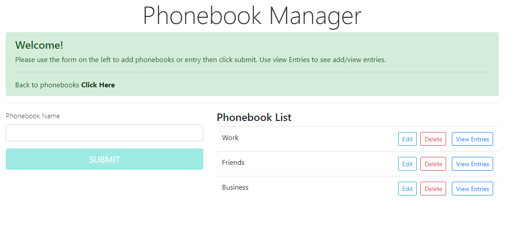
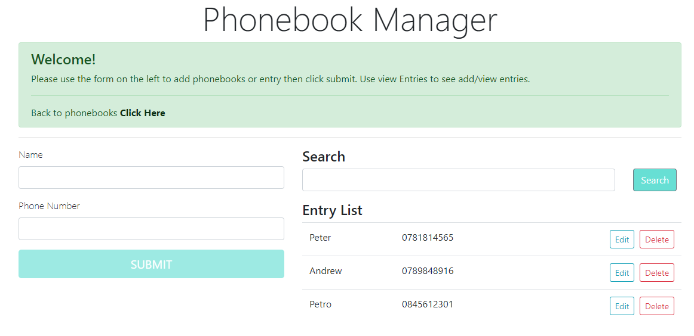

# Angular 9 and .Net Core Web API

A simple phone book application using Angular 9 for front end and .net core 3.1 web api for backend.

## Front End Application
<i>Before running this Project</i>
1.	Install npm packages using 'npm install' command from Angular folder.
2.	Run ng serve

## Database 
<i>Before running this Project</i>
1.	Run the CreateDatabase.sql script
2.	Edit the application.json connection string to point to the database.

## Back End Application
<i>Before running this Project</i>
1.	Make .net core 3.1 is installed
2.	Run dotnet restore from project command line
3.	Run dotnet run from project command line

## The Application
The applications allows to maintain “phonebooks” and their entries. To begin create a PhoneBook enter the name of the Phonebook and click Submit. To manage Entries for this phonebook click View Entries

To add an entry the person name and number the click submit. To search enter a part of the person’s name and click search.

